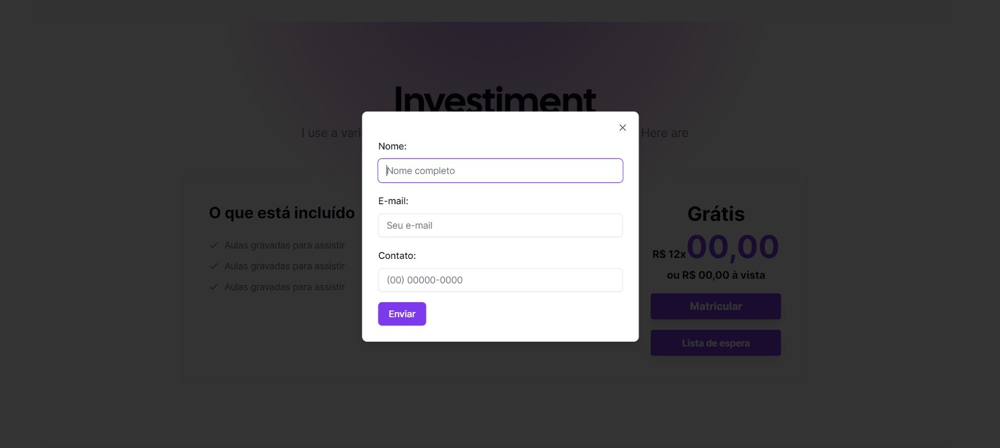

# Landing Page - Next.js

## Índice
- [Visão Geral](#visão-geral)
    - [Imagens](#Imagens)
- [Funcionalidades](#funcionalidades)
- [Tecnologias Utilizadas](#tecnologias-utilizadas)
- [Começando](#começando)
  - [Pré-requisitos](#pré-requisitos)
  - [Instalação](#instalação)
  - [Executando o Projeto](#executando-o-projeto)
- [Deploy](#deploy)
- [Contribuindo](#contribuindo)
- [Contato](#contato)

## Visão Geral
Este é um projeto de landing page construído usando Next.js. A landing page é projetada para ser simples, responsiva e rápida. Você pode ver a versão ao vivo do projeto. 
[LandingPage-Next](https://landingpage-next-sigma.vercel.app/)

## Imagens
Aqui estão algumas imagens do projeto:
<div>
    
    
    
    
    
    
    
</div>
 

## Funcionalidades
- Design responsivo
- Carregamento rápido
- Otimizado para SEO
- Fácil de personalizar

## Tecnologias Utilizadas
- [Next.js](https://nextjs.org/)
- [React.js](https://reactjs.org/)
- [Tailwind_css](https://tailwindcss.com/)
- [shadcn/ui](https://ui.shadcn.com/)
- [Vercel](https://vercel.com/)

## Começando

### Pré-requisitos
- Node.js (v14.x ou superior)
- npm

### Instalação
1. Clone o repositório:
    ```bash
    git clone https://github.com/DalioSY/landingpage-next.git
    ```

2. Navegue até o diretório do projeto:
    ```bash
    cd landingpage-next
    ```

3. Instale as dependências:
    ```bash
    npm install
    ```

### Executando o Projeto
1. Inicie o servidor de desenvolvimento:
    ```bash
    npm run dev
    ```

2. Abra [http://localhost:3000](http://localhost:3000) no seu navegador para ver o projeto.

## Deploy
Este projeto está implantado usando Vercel. Para implantar sua própria versão, você pode seguir estas etapas:
1. Envie seu código para um repositório no GitHub.
2. Vá para [Vercel](https://vercel.com/) e crie um novo projeto.
3. Conecte seu repositório GitHub.
4. Implante seu projeto.

## Contribuindo
Contribuições são bem-vindas! Por favor, siga estas etapas para contribuir:
1. Faça um fork do repositório.
2. Crie uma nova branch (`git checkout -b feature/SuaFuncionalidade`).
3. Faça suas alterações.
4. Faça um commit das suas alterações (`git commit -m 'Adicionei uma nova funcionalidade'`).
5. Envie para a branch (`git push origin feature/SuaFuncionalidade`).
6. Crie um novo Pull Request.

## Contato
- **Dalio Shindi Yamada**
- [GitHub](https://github.com/DalioSY)
- [LinkedIn](https://www.linkedin.com/in/dalio-s-yamada)
- [Portfólio](https://daliosy.github.io/my-PORTFOLIO)


